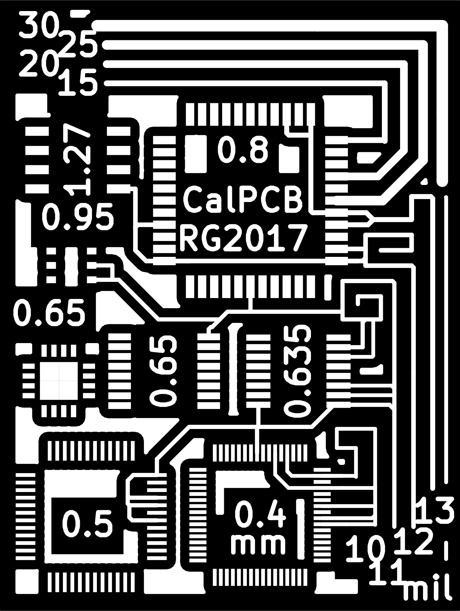

# Test your PCB production capabilities!

Test PCB for calibrating laser engraver PCB production process.
This of course could be used to test any home-etched PCB processes capabilities.

The PCB has various common package footprints and traces with different thicknesses. The traces have some artificial routing and connections to pads to simulate real application.

The board size is 3x4 cm.

     

### Component footprints on board 

 | Package | Pin pitch (mm) |
 |---------|----------------|
 | SOIC    |           1.27 |
 | DFN     |           0.95 |
 | TQFP    |            0.8 |
 | QFN     |           0.65 |
 | TSSOP   |           0.65 |
 | QSOP    |          0.635 |
 | TQFP    |            0.5 |
 | TQFP    |            0.4 |
 |         |                |

### Trace widths on board (mil):
 - 30
 - 25
 - 20
 - 15
 - 13
 - 12
 - 11
 - 10

## How to use this
The PCB is prepared using freely available KiCad. All the footprints come from the standard libraries. PDF and SVG exports of copper layer is provided in the `PCBv*/exports` folder.
